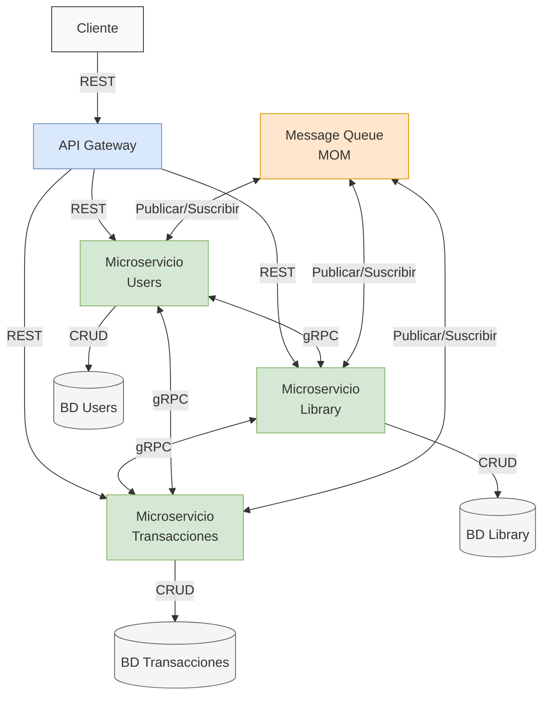

# Proyecto1-RPC-MOM
Este proyecto implementa una arquitectura distribuida basada en microservicios, diseñada para ser escalable, resiliente y eficiente en el manejo de peticiones y fallos. La solución aborda los principales desafíos del desarrollo moderno mediante la integración de distintos componentes y tecnologias funcionales.

Una version en video sobre este proyecto puede ser vista en el siguiente enlace: 
https://youtu.be/Dzy2h7SX1Cc

## Componentes del proyecto
-   **API Gateway**: Un punto de entrada centralizado que gestiona todas las peticiones del cliente, aplicando reglas de enrutamiento, autenticación y control de acceso.
    
-   **Comunicación REST**: Los clientes se comunican con el sistema utilizando API RESTful, asegurando compatibilidad y facilidad de uso.
    
-   **Interacción entre microservicios con gRPC**: Se emplea gRPC para lograr una comunicación rápida y eficiente entre los servicios internos.
    
-   **Middleware orientado a mensajes (MOM)**: Implementación personalizada que permite la gestión de fallos (failover) y desacopla la comunicación entre servicios.

Este repositorio contiene el código fuente, las configuraciones necesarias y la documentación para desplegar, ejecutar y entender cada componente del sistema.

### Requerimientos Funcionales
1. Cliente REST:  
-   Permitir la comunicación con el sistema mediante peticiones HTTP. 
-   Soportar operaciones CRUD en los microservicios según la funcionalidad definida.
    

2.  API Gateway:  
-   Actuar como intermediario entre el cliente y los microservicios.  
-   Gestionar la autenticación y autorización de las solicitudes.
-   Encaminamiento de peticiones hacia los microservicios correspondientes.
    

3.  Comunicación gRPC:  
-   Garantizar la comunicación eficiente entre microservicios.
-   Utilizar Protocol Buffers para la serialización de datos.
    
4.  Message-Oriented Middleware (MOM):  
- Gestionar el almacenamiento de mensajes en caso de fallo de un microservicio.
- Reintentar la entrega de mensajes cuando un servicio vuelva a estar operativo.
    

5.  Mecanismo de Failover:  
-   Implementar una lógica de recuperación para procesar mensajes pendientes.
-   Mantener la integridad de los datos y evitar pérdidas en caso de fallos.
    

### Requerimientos No Funcionales

1.  Escalabilidad:  
-   El sistema debe soportar un aumento en la carga de trabajo sin degradar el rendimiento.
   
2.  Disponibilidad y Tolerancia a Fallos:  
-   Implementar estrategias de failover para garantizar la continuidad del servicio.
    
-   Evitar la pérdida de datos en caso de fallos en la comunicación.
    

3.  Eficiencia y Rendimiento:  
-   Minimizar la latencia en la comunicación entre microservicios.
-   Optimizar el consumo de recursos del sistema.
    

4.  Seguridad:  
-   Proteger las comunicaciones mediante protocolos seguros (por ejemplo, TLS en gRPC y HTTPS en REST).
-   Implementar mecanismos de autenticación y autorización en el API Gateway.
    

5.  Mantenibilidad:  
-   Código modular y documentado para facilitar futuras mejoras.
-   Uso de buenas prácticas en la arquitectura y desarrollo.
    
6.  Compatibilidad:  
-   Asegurar la interoperabilidad entre los diferentes componentes del sistema.
-   Permitir la integración con diferentes bases de datos y herramientas.

# Arquitectura de Microservicios

## Diagrama de Arquitectura general


## Funcionamiento Componentes del Proyecto

- **API Gateway**  
  Punto de entrada HTTP REST desarrollado en C++ con Crow. Traduce solicitudes HTTP a gRPC y las envía al Middleware MOM.
  
- **MOM (Middleware Orientado a Mensajes)**  
  Servidor gRPC en C++ que enruta las peticiones de la API Gateway hacia los microservicios adecuados según el tipo de operación.

- **Microservicios**  
  - `inventory`: Gestión de libros (C++, gRPC).
  - `users`: Gestión de usuarios (Go, gRPC).
  - `orders`: Gestión de órdenes (C++, gRPC).

- **Cliente**  
  Aplicación de consola en C++ que interactúa con la API REST usando `curl`.

- **Archivos .proto**  
  Definen todos los mensajes y servicios gRPC usados entre los componentes.

---

## Desarrollo

### API Gateway
- Implementado en C++ con Crow.
- Escucha en el puerto `8081`.
- Convierte peticiones HTTP JSON en llamadas gRPC.
- Usa un stub gRPC generado desde `mom.proto`.

### MOM (Middleware)
- Servidor gRPC que expone el servicio `MomService`.
- Implementado en `main.cpp` y `mom_routes.cpp`.
- Recibe llamadas de la API y las reenvía a los microservicios por gRPC.

### Microservicios
- **inventory** (C++): Permite obtener, buscar, agregar y eliminar libros.
- **users** (Go): Permite registrar, autenticar y actualizar usuarios.
- **orders** (C++): Permite crear órdenes y listarlas por usuario.
- Todos implementan persistencia en JSON local.

### Cliente
- Menú por consola que permite enviar comandos HTTP a la API.
- Usa `system()` y `curl` para comunicarse.
- Simula la experiencia de un consumidor real de la API.

---

## Comunicación entre Componentes

```text
Cliente (HTTP via curl)
        ↓
API Gateway (Crow + gRPC client stub)
        ↓
MOM (Servidor gRPC)
        ↓
Microservicios (gRPC)
```
##  Despliegue

### Infraestructura

Cada componente corre en una instancia EC2 separada (AWS).

Se asignaron puertos específicos para cada servicio:

- **API Gateway**: `8081` (HTTP)
- **MOM**: `50055` (gRPC)
- **Inventory**: `50051` (gRPC)
- **Orders**: `50052` (gRPC)
- **Users**: `50053` (gRPC)

---

### Seguridad

- Se configuraron reglas de grupo de seguridad (firewall) para permitir únicamente el tráfico necesario entre instancias.
- Se utilizaron **IP's elásticas asignadas** para garantizar disponibilidad.

---

## Compilación y Ejecución

### Cliente

```bash
g++ client.cpp -o cliente
./cliente
```

### API Gateway

```bash
cd api-gateway
mkdir build && cd build
cmake ..
make
./gateway
```


### Middleware (MOM)

```bash
cd mom
mkdir build && cd build
cmake ..
make
./mom
```
### Microservicios

### Inventory / Orders (C++)

```bash
mkdir build && cd build
cmake ..
make
./inventory_service   # o ./orders_service
```

### Users (Go)

```bash
cd users
go run main.go
```


